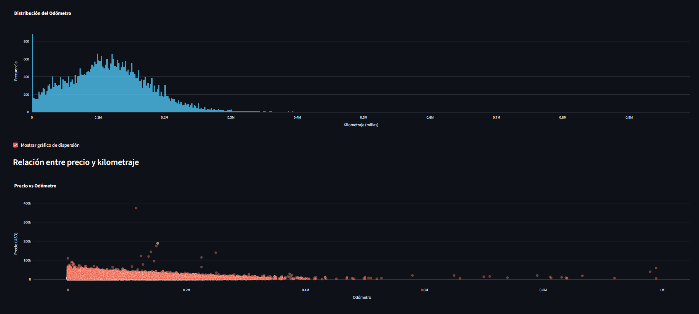

# App de anuncios de vehículos

Esta aplicación web fue desarrollada con Streamlit y permite visualizar datos de anuncios de vehículos usados.

## Funcionalidades
- Visualización de los primeros 200 datos
- Visualización de la distribución del kilometraje (histograma).
- Gráfico de dispersión entre precio y odómetro.
- Interfaz interactiva con casillas de verificación.

## Tecnologías utilizadas
- Python
- Pandas
- Plotly
- Streamlit

## Estructura del proyecto
- app.py: aplicación principal
- vehicles_us.csv: conjunto de datos
- notebooks/EDA.ipynb: análisis exploratorio
- requirements.txt: dependencias del proyecto
- README.md: breve descripción del proyecto

## Enlace a la aplicación
https://proyecto-autos.onrender.com
